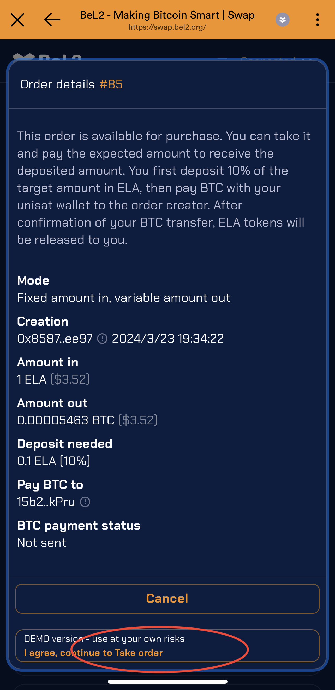
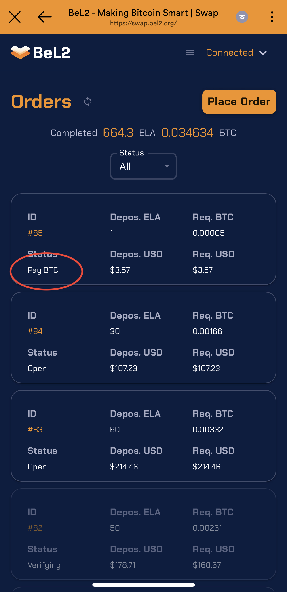
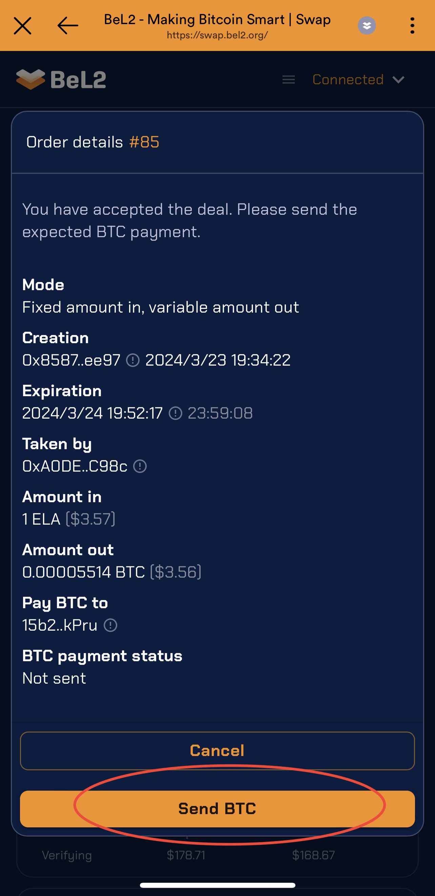
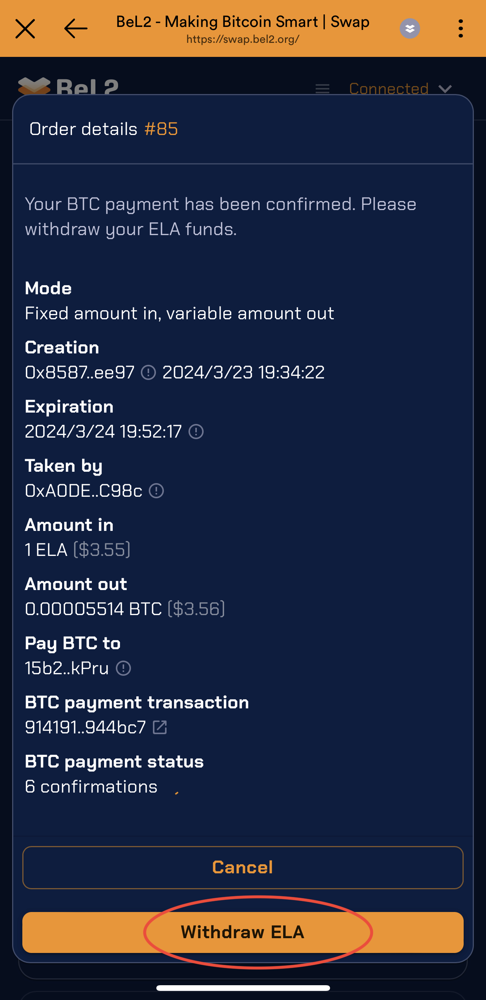

# 接受订单

1. 选择（点击）处于`Open`状态的订单
2. 弹出订单详情，显示订单中ELA和BTC的数量。确认后点击“Take order”按钮，将创建Take Order交易，即接受该订单，其他人无法再接受该订单。接受订单时，需要支付订单金额10%的ELA作为质押金。质押金将在订单完成后自动取回。

<figure><figcaption></figcaption></figure>

3. **发送BTC**：Order的状态将变为`Pay BTC`，点击交易详情页面下方的`Send BTC`按钮，发送BTC。

<figure><figcaption></figcaption></figure>

 

<figure><figcaption></figcaption></figure>

4. **发送支付证明**：`BTC payment status`表示BTC交易的状态，将该交易的确认超过1后，页面下方的按钮将变为`Submit payment proof`，点击该按钮将发送`交易证明`交易。

<figure><figcaption></figcaption></figure>

5. **取回订单中的ELA：**当Payment Proof完成验证后，Order状态将变为`Verified`。进入订单详情页，点击页面下方按钮\`\`，将取回订单中的ELA和质押金。

<figure><figcaption></figcaption></figure>

 

<figure><figcaption></figcaption></figure>

