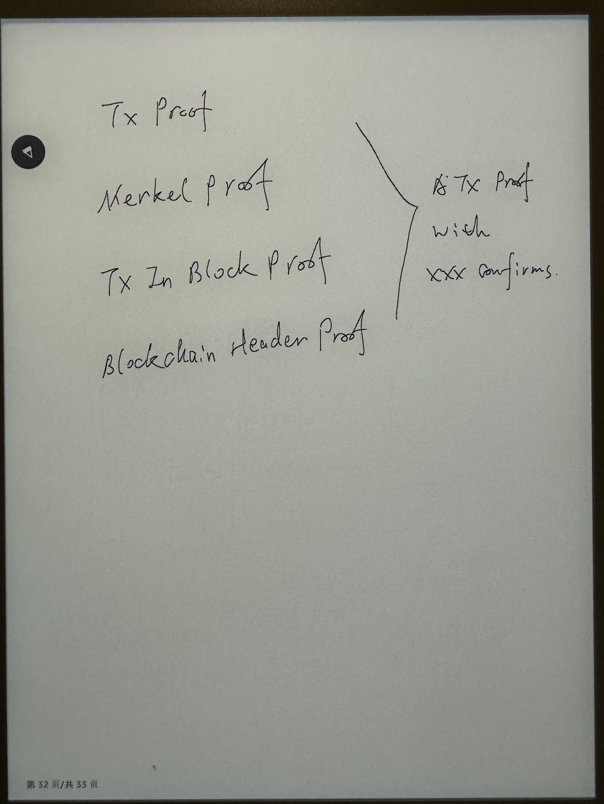
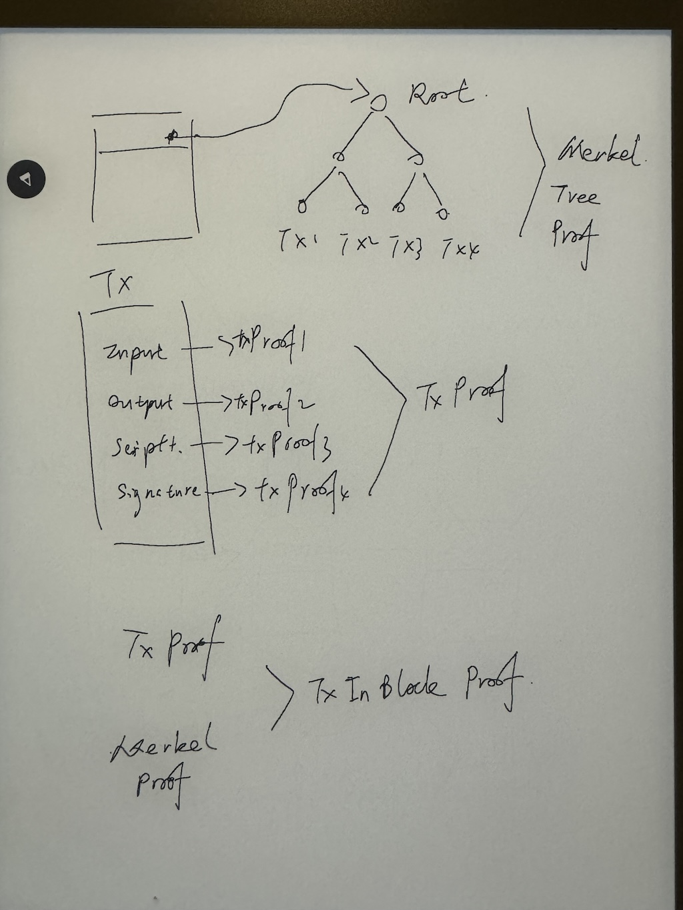
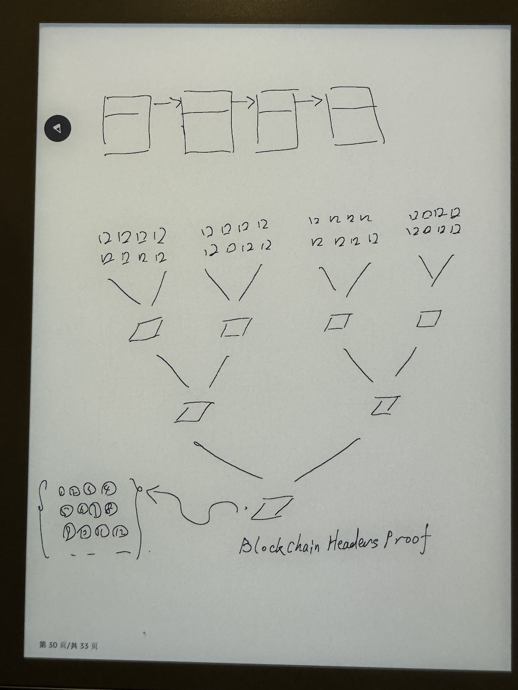
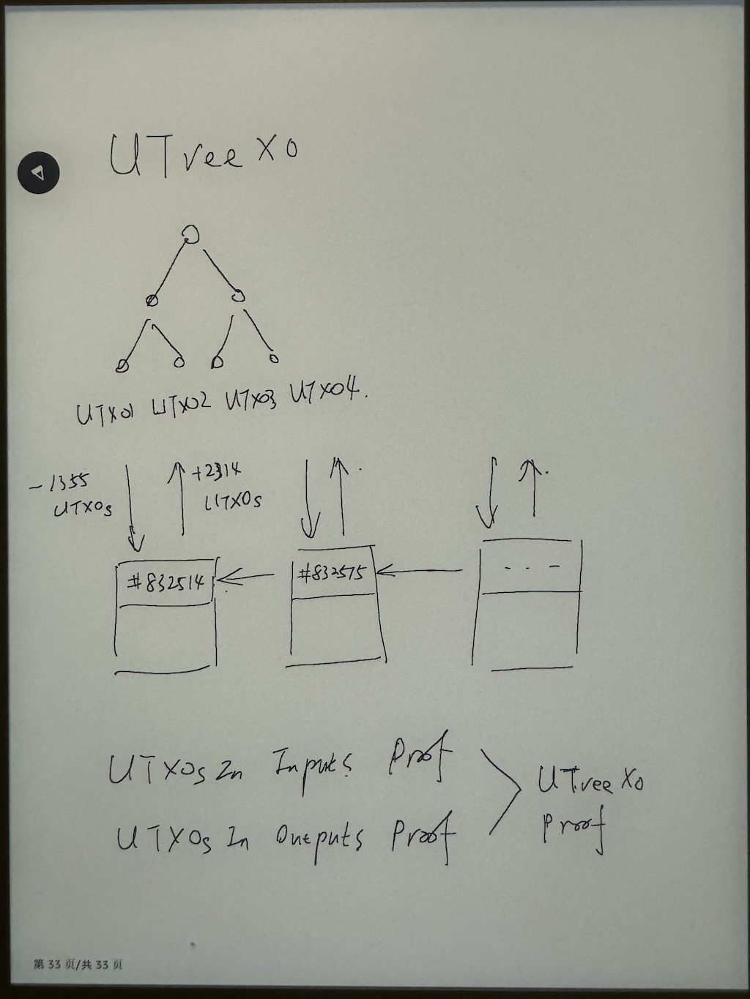

# ZK Proof Bitcoin Full Node

BeL2最初受到ZeroSync的启发，ZeroSync提出了实现ZK Full Node的目标，但它止步于区块头的验证。BeL2可以看作是ZeroSync的延续，BeL2使用Cairo(1)，从分析和证明交易的内容开始，再结合区块头的验证，最终实现全链的证明。这样，对于一个BTC Full Node而言，它不必存储高达500G的历史数据，只需要保存有效的UTXO集合，即便分享信息给其它访问者，也可以通过提供零知识证明的方式证明其提供的数据的真实性。这相比于现有的BTC RPC服务来说，是一个巨大的进步，因为它是无需信任的。可以通过证明自证清白。

### 交易证明

<figure><figcaption></figcaption></figure>

交易是BTC写入数据的最小单位，所有的数据都通过交易的方式写在BTC链上。证明一个交易是否有效，以及具体交易内容，需要完成以下几个证明

* 交易本身的有效性验证，以及交易内容的验证
* 通过验证区块的默克尔树路径证明交易被该默克尔树包含
* 验证区块头信息证明交易在某个区块内，被这个区块包含
* 验证区块头在BTC的链上，并有若干个区块的确认

<figure><figcaption></figcaption></figure>

BeL2针对每项内容进行验证和证明，再将所有证明递归合并为一个证明，最终通过这个证明可以证实交易的有效性和真实性。

事实上，为了让验证可以更高效率被完成，每个交易又被拆分为多个子电路，这些证明可以被并行执行，最终再汇总在一起。

### 区块头的证明

区块头的证明采用类似ZeroSync的机制，将多个区块头合并处理，经过多次批量验证，将所有被验证的区块头汇总为一条前后关联的链式结构，并生成对应的证明。当需要验证任何一个区块时，只要证明在这个链式结构里，即可为其生成一个“链上证明”，并且还可以通过计算其后包含多少个后续区块来得到这个区块已有了几次确认。

<figure><figcaption></figcaption></figure>

针对区块头的验证，包括区块Hash的计算，前后区块关联Hash的验证，前后算力难度值的验证，以及处理最新区块的分叉。

### 有效UTXOs集合

<figure><figcaption></figcaption></figure>

在建立了BTC全链区块头的证明以后，我们可以对所有区块包含的交易进行扫描，分析其输入Inputs UTXO和输出Outputs UTXO。我们可以从创始块开始建立一个“有效UTXO集合“，采用UTreeXO数据结构存储。

从创始块的Coinbase交易开始，作为第一个Input加入到UTreeXO里，其后每个交易的Input都被从UTreeXO中移除，每个交易的Output都被加入到UTreeXO。如此往复循环，将一个区块内所有的交易都过滤一遍之后，UTreeXO的内容就是当前区块结束后最新的未花费的UTXO的集合。

接着再处理第二个区块，第三个区块……，当处理到最新高度以后，我们就可以拥有一个全网未花费的UTXO的集合。并且也同时生成了这个集合的零知识证明。

通过这个集合和证明，我们可以为任何一个UTXO提供其未被花费的证明。我们也可以为不在这个集合的UTXO提供其不存在的证明，从而可以证明其已被花费或者并不存在。

我们还可以通过遍历将属于某个地址的证明收集在一起，为这个地址生成一个BTC余额证明。也可以帮助验证尚处于交易池中的转账使用的UTXO是否有效。

再进一步，如果我们能为BTC上承载的BRC20，RUNS，TAPROOT ASSETS内容也生成证明，我们可以为他们生成专属的UTreeXO集合和证明，这样就不必依赖第三方Indexer即可验证这些衍生协议的转账是否有效，为客户端验证模型提供更高效的技术方案。

