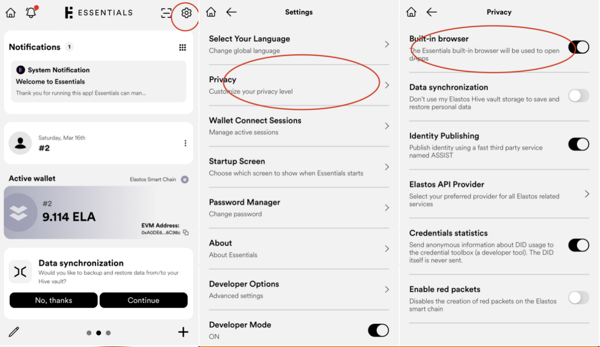
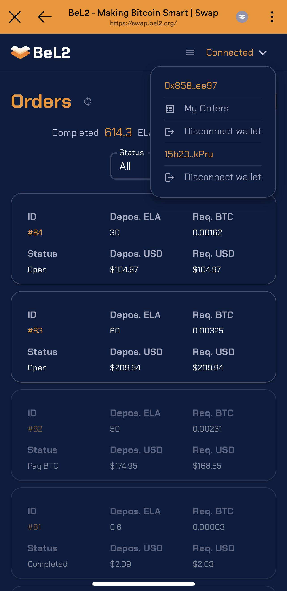

# 准备工作

1.  **安装软件**：移动端推荐安装Essentials钱包，桌面端请使用Chrome浏览器并安装MetaMask钱包和UniSat钱包。

    > Essentials钱包下载链接：
    >
    > * iOS: [https://apps.apple.com/us/app/web3-essentials-crypto-wallet/id1568931743](https://apps.apple.com/us/app/web3-essentials-crypto-wallet/id1568931743)
    > * Android: [https://download.elastos.io/app/elastos-essentials/Essentials.apk](https://download.elastos.io/app/elastos-essentials/Essentials.apk)
2. **备份重要信息**：确保备份你的钱包助记词和其他重要信息。
3. **准备资金**：ESC钱包中需要有一定数量的ELA（ESC Network）作为挂单金额和ESC上交易的Gas Fee，BTC钱包中需要有一定数量的BTC，作为Take Order时的花费及BTC上的gas fee。
4. 在Essentials钱包中开启`Build-in browser`

<figure><figcaption>
Enable Build-in browser
</figcaption></figure>

5. **访问BTC Swap**：在Essentials的`Discover dApps`中打开BTC Swap网站[https://swap.bel2.org/](https://swap.bel2.org/) 。

<figure><figcaption></figcaption></figure>

6. **连接钱包：**

* 点击“Connect EVM Wallet”，选择连接的钱包。如使用Essentials打开，则将自动连接与Essentials钱包连接。
* 点击“Connect Bitcoin Wallet”，选择“Essentials”，完成与BTC Wallet的连接。

<figure><figcaption>
Connect Bitcoin Wallet
</figcaption></figure>

* 连接成功后，点击页面右上角”Connected“将可以看到ESC和BTC的地址等信息。

<figure><figcaption></figcaption></figure>
