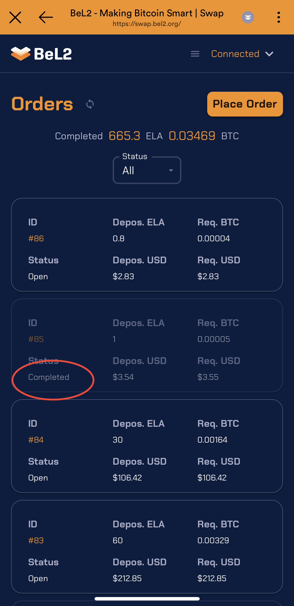

# Completing the Exchange

1. **Receiving ELA**: Once the transaction is confirmed, the order status will change to `Completed`. The ELA will be sent to the ESC chain address of the order maker. The balance change can be seen in the wallet.

<figure><figcaption></figcaption></figure>
