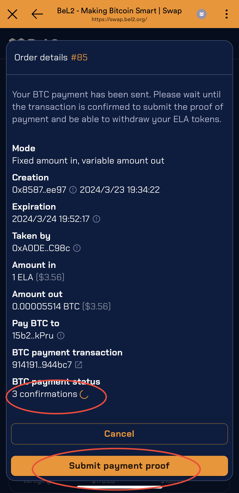
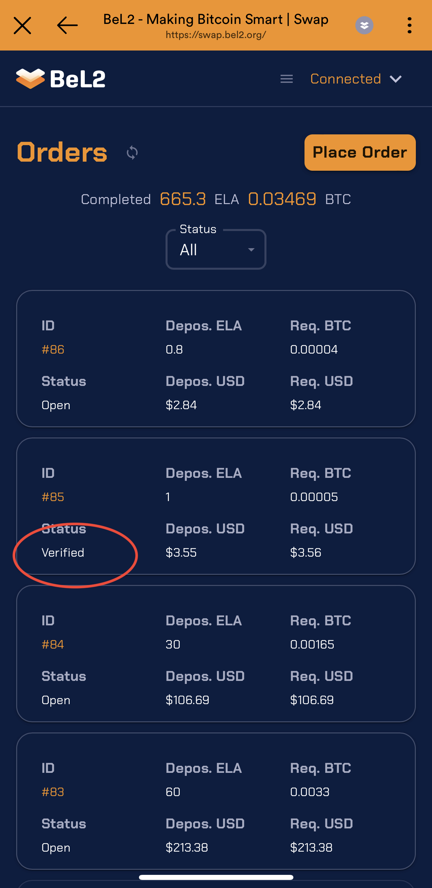

# Take Order

1. Select (click) an order that is in `Open` status.
2. The order details will pop up, showing the amounts of ELA and BTC in the order. After confirming, click the `Take order` button to create a Take Order transaction, thus accepting the order. This prevents others from taking the same order. When taking an order, 10% of the order amount in ELA is required as a deposit. The deposit will be automatically retrieved upon order completion.

<figure><figcaption></figcaption></figure>

3. **Send BTC**: The order status will change to `Pay BTC`. Click the `Send BTC` button at the bottom of the transaction detail page to send BTC.

<figure><figcaption></figcaption></figure>

 

<figure><figcaption></figcaption></figure>

4. **Submit Payment Proof**: The `BTC payment status` indicates the status of the BTC transaction. Once the transaction is confirmed more than once, the button at the bottom of the page will change to `Submit payment proof`. Clicking this button will send a `transaction proof` transaction.

<figure><figcaption></figcaption></figure>

5. **Retrieve ELA from the Order**: Once the Payment Proof is verified, the Order status will change to `Verified`. Enter the order details page and click the button at the bottom of the page to retrieve the ELA and deposit from the order.

<figure><figcaption></figcaption></figure>

 

<figure><figcaption></figcaption></figure>

